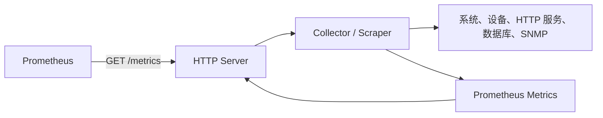
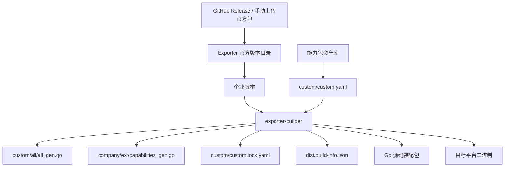
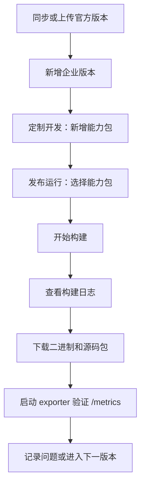

# Exporter Studio 使用与开发手册

本文档用直白方式说明三件事：

1. exporter 本身是什么架构。
2. Exporter Studio 如何把企业二次开发能力包嵌入 exporter。
3. 开发同学如何使用这个工具新增能力包、构建企业版、验证和下载产物。

## 一、先把概念说清楚

### 1. exporter 是什么

Prometheus 的 exporter 本质上是一个 HTTP 服务。它负责把某个系统、设备或中间件的状态转换成 Prometheus 指标格式。

典型访问方式：

```text
Prometheus -> HTTP GET /metrics -> exporter -> 返回指标文本
```

返回内容大概长这样：

```text
# HELP node_time_seconds System time in seconds.
# TYPE node_time_seconds gauge
node_time_seconds 1783415042
```

不同 exporter 的采集来源不同：

| exporter | 常见采集对象 | 常见方式 |
| --- | --- | --- |
| node_exporter | Linux 主机 | 读取 `/proc`、`/sys`、系统调用 |
| windows_exporter | Windows 主机 | 读取 Windows 性能计数器、WMI、服务状态 |
| snmp_exporter | 网络设备 | SNMP 协议 |
| blackbox_exporter | URL、TCP、ICMP 探测 | 主动探测目标 |
| mysqld_exporter | MySQL | 连接数据库查询状态 |

所以 exporter 一般由几部分组成：



### 2. 官方版本和企业版本是什么关系

Exporter Studio 的目标不是重写官方 exporter，而是用 Git 和构建流程管理企业定制版本。

推荐关系是：

```text
企业发行版本 =
官方 upstream 基线
+ company/ext 稳定扩展接口
+ custom/custom.yaml 中选择的一组能力包
+ 构建配置
+ 必要的主干补丁
```

更直白地说：

- 官方 exporter 源码尽量少改。
- 企业本地分支使用 `cmg/...` 命名。
- 能力包放在 `custom/capabilities/<能力包名>/`。
- 能力包不直接绑死某一个小版本，构建时选择装配。
- 侵入官方主干的修改要作为“版本补丁”记录，不要伪装成能力包。

## 二、Exporter Studio 的整体架构

### 1. 页面模块

| 页面 | 作用 |
| --- | --- |
| 工作台 | 看当前 exporter、企业版本、能力包、构建情况 |
| 版本治理 | 维护官方基线、企业版本、部门、联系人、小版本备注 |
| 定制开发 | 新增和编辑 Capability Package 能力包 |
| 发布运行 | 选择企业版本、官方版本包、能力包，然后构建、下载 |
| 操作记录 | 查看同步、保存、构建等动作 |

### 2. 后端数据流



### 3. 关键目录和文件

| 路径 | 作用 | 谁维护 |
| --- | --- | --- |
| `.exporter.yaml` | 当前企业版本的元数据 | 系统生成 |
| `company/ext/` | 企业稳定扩展接口 | 平台维护，少改 |
| `custom/capabilities/<name>/` | 能力包源码 | 开发同学通过页面维护 |
| `custom/custom.yaml` | 本次构建选择哪些能力包 | 系统生成 |
| `custom/custom.lock.yaml` | 构建锁定文件，记录能力包版本和文件 | 系统生成 |
| `custom/all/all_gen.go` | blank import 装配入口 | 系统生成 |
| `company/ext/capabilities_gen.go` | 能力包元数据注册表 | 系统生成 |
| `dist/build-info.json` | 构建结果、目标平台、能力包、校验信息 | 系统生成 |
| `build/exporter-builder.yaml` | 构建配置 | 系统生成 |

## 三、能力包体系

### 1. Capability Package 是什么

Capability Package 就是“可复用的二开能力包”。

它不是零散补丁，也不是运行时 `.so plugin`。它是源码包，构建时会被编译进企业版 exporter。

一个能力包通常包含：

- 能力包 ID
- 类型 `kind`
- 版本
- 负责人
- 描述
- 依赖关系
- 产出的指标
- 兼容范围
- 生成出来的 Go 源码文件

### 2. 支持的能力类型

| kind | 用途 | 例子 |
| --- | --- | --- |
| `collector` | 新增采集器 | 增加厂商设备电源指标 |
| `scraper` | 主动访问外部服务拉取数据 | 调 HTTP 接口取状态 |
| `metric` | 新增固定或计算型指标 | 增加业务版本指标 |
| `transform` | 修改、过滤、补充指标标签 | 给指标加 `region` 标签 |
| `security` | 请求认证、鉴权、中间件 | `/metrics` 必须带 `testauth` |
| `credential_provider` | 凭据获取 | 从文件、环境变量读取 token |
| `discovery` | 目标发现 | 从 CMDB 发现目标 |
| `config_profile` | 配置模板 | 华为交换机 SNMP profile |
| `protocol_client` | 协议客户端 | 封装某厂商 HTTP API |
| `cache` | 缓存能力 | 缓存远端接口结果 |
| `bundle` | 组合包 | 一键选择多个能力包 |

### 3. CapabilityInfo 结构

`company/ext` 中统一定义能力包元数据：

```go
type CapabilityInfo struct {
    Name           string
    Kind           CapabilityKind
    Version        string
    Description    string
    Owner          string
    ImportPath     string
    Source         string
    DefaultEnabled bool
    Provides       []string
    Requires       []string
    Metrics        []string
    Config         map[string]string
    Compatible     CompatibleRange
    Files          []string
}
```

字段含义：

| 字段 | 说明 |
| --- | --- |
| `name` | 能力包名称 |
| `kind` | 能力类型 |
| `version` | 能力包版本 |
| `description` | 说明 |
| `owner` | 负责人 |
| `import_path` | Go import 路径 |
| `source` | 源码路径 |
| `default_enabled` | 是否默认启用 |
| `provides` | 提供什么能力 |
| `requires` | 依赖哪些能力 |
| `metrics` | 产生或影响哪些指标 |
| `config` | 能力包配置 |
| `compatible` | 兼容哪些 exporter |
| `files` | 能力包包含的文件 |

## 四、能力包如何嵌入 exporter

### 1. 稳定 hook：company/ext

`company/ext` 是企业扩展的稳定接口层。官方 exporter 主干只需要保留很少的接入点。

核心原则：

- 官方代码尽量少动。
- 官方主程序不要手动 import 具体能力包。
- 主程序只接入统一 hook。
- 具体能力包由构建器自动装配。

主程序理想接入方式：

```go
import _ "<module-path>/custom/all"
```

如果某个 exporter 有自己的 collector registry，还需要在合适位置调用稳定扩展接口，例如：

```go
companyext.RegisterCompanyExt()
```

具体 hook 位置要按 exporter 类型判断：

| exporter | 可能接入点 |
| --- | --- |
| node_exporter | collector 注册表附近 |
| windows_exporter | collector 或 handler 初始化附近 |
| snmp_exporter | generator/config 或 module 装配附近 |
| blackbox_exporter | prober 或 module 装配附近 |

### 2. custom 目录：能力包装配层

`custom` 不是零散补丁目录，它是能力包装配层。

推荐结构：

```text
custom/
  custom.yaml
  custom.lock.yaml
  all/
    all_gen.go
  capabilities/
    testauth/
      capability.go
    huawei_power/
      collector.go
    http_health/
      scraper.go
```

能力包都放在：

```text
custom/capabilities/<capability-name>/
```

不要按类型拆成 `collector/`、`scraper/` 顶层目录。类型由 `kind` 决定。

### 3. custom/custom.yaml：选择清单

`custom/custom.yaml` 记录本次构建选择了哪些能力包。

示例：

```yaml
schema: custom-package-selection
compile_mode: source-build
stable_hook: company/ext/registry.go:RegisterCompanyExt
packages:
  - package_id: testauth
    name: 测试认证
    kind: security
    version: 1.0.0
    source: custom/capabilities/testauth/capability.go
  - package_id: http_health
    name: HTTP 健康探测
    kind: scraper
    version: 1.0.0
    source: custom/capabilities/http_health/scraper.go
```

它回答的问题是：

```text
这次企业版 exporter 具体装了哪些能力包？
```

### 4. custom/all/all_gen.go：源码装配入口

构建器根据 `custom/custom.yaml` 生成：

```go
package all

import (
    _ "example.com/exporter/custom/capabilities/testauth"
    _ "example.com/exporter/custom/capabilities/http_health"
)
```

这一步的作用是让 Go 编译器把选中的能力包编译进最终产物。

### 5. company/ext/capabilities_gen.go：元数据注册表

系统生成统一注册表：

```go
package ext

func init() {
    RegisterCapability(CapabilityInfo{
        Name: "testauth",
        Kind: CapabilitySecurity,
        Version: "1.0.0",
    })
}
```

注意：当前设计中，能力包源码不再自己注册 `CapabilityInfo`。元数据统一由 `company/ext/capabilities_gen.go` 注册，避免重复注册。

### 6. custom/custom.lock.yaml：锁定文件

lock 文件记录本次构建实际使用的能力包版本、源码文件、依赖和校验信息。

它回答的问题是：

```text
这个构建到底用了哪些能力包的哪些版本？
```

### 7. dist/build-info.json：构建信息

`build-info.json` 记录：

- exporter 名称
- 官方基线版本
- 企业版本
- 目标平台
- 能力包列表
- 构建产物
- 源码验证结果
- 二进制信息

构建记录页面后续主要读取它展示构建详情。

## 五、当前工具的真实边界

这部分很重要，避免测试和开发误解。

### 当前已经做到

- 能同步 GitHub Release 资产。
- 能手动上传固定官方版本包。
- 能维护企业版本和管理信息。
- 能维护可复用能力包资产。
- 能根据选择生成：
  - `custom/custom.yaml`
  - `custom/custom.lock.yaml`
  - `custom/all/all_gen.go`
  - `company/ext/capabilities_gen.go`
  - `dist/build-info.json`
- 能执行 Go 编译。
- 能按目标平台生成二进制名称：
  - `node_exporter` 默认 `linux/amd64`，没有 `.exe`
  - `windows_exporter` 默认 `windows/amd64`，有 `.exe`
- 能下载源码装配包、构建信息、构建日志、二进制。

### 当前仍需注意

当前生成的二进制是“企业装配验证型 exporter 服务”，用于验证能力包装配、认证、指标输出、构建流程和下载能力。

如果要得到“完整官方 exporter + 企业能力包”的最终形态，还需要在对应官方 exporter 源码中落稳定 hook，再执行该 exporter 官方构建命令。

这不是页面使用问题，而是官方 exporter 各自架构不同：

- node_exporter 有自己的 collector 注册方式。
- windows_exporter 有 Windows collector 和 handler 初始化逻辑。
- snmp_exporter 受 generator 和配置影响。
- blackbox_exporter 受 prober/module 影响。

所以最终生产落地应按 exporter 类型逐个确认 hook 位置。

## 六、开发同学如何使用这个工具

### 1. 准备环境

进入项目目录：

```powershell
cd "C:\Users\Administrator\Documents\exporter studio"
```

启动服务：

```powershell
npm start
```

打开：

```text
http://localhost:3000/
```

运行测试：

```powershell
npm test
```

如果要真实编译，需要安装 Go，并保证命令行能执行：

```powershell
go version
```

### 2. 同步或上传官方版本

进入“版本治理”。

官方版本来源有两种：

| 方式 | 适用场景 |
| --- | --- |
| 同步 GitHub Release | 能访问 GitHub 或内网 GitHub 代理 |
| 手动上传 | 内网隔离、指定固定版本、测试同学提供离线包 |

如果内网不能直连 GitHub，可以配置服务端环境变量：

```powershell
$env:GITHUB_API_BASE_URL="https://你的内网代理/api.github.com"
npm start
```

### 3. 新增企业版本

在“版本治理”点击新增版本。

建议只填写业务上需要维护的信息：

- exporter 名称
- 官方版本包
- 小版本备注
- 监控系统
- 部门
- 联系人

不建议手填：

- `custom` 目录
- hook 文件
- hook 符号
- lock 文件路径

这些由系统生成。

默认规则：

```text
Exporter: node_exporter
企业分支: cmg/node_exporter
企业版本: node_exporter-internal-1.0.0
```

### 4. 新增能力包

进入“定制开发”。

点击“新增能力包”。

需要填写：

- 能力包 ID
- 能力包名称
- kind 类型
- 版本
- 负责人
- 描述
- 可编辑代码区域

保存后，能力包进入资产库。

注意：保存能力包只是沉淀资产，不代表每个企业版本都会使用它。真正使用是在“发布运行”里选择能力包。

### 5. 常见能力包怎么写

#### 认证能力：访问 `/metrics` 必须带 testauth

类型选择：

```text
security
```

思路：

- 能力包声明这是一个 security 能力。
- 构建后的 exporter 在 `/metrics` 前检查请求头。
- 不带 `testauth` 返回 `401`。
- 带 `testauth` 返回指标。

测试方式：

```powershell
curl http://127.0.0.1:9116/metrics
curl -H "testauth: ok" http://127.0.0.1:9116/metrics
```

#### HTTP 拉取指标

类型选择：

```text
scraper
```

适用场景：

```text
exporter 需要访问某个 HTTP 服务，把返回结果转换成 Prometheus 指标。
```

示例逻辑：

```go
endpoint := "http://127.0.0.1:8080/health"
metric := Metric{
    Name: "external_service_up",
    Type: "gauge",
    Labels: map[string]string{"endpoint": endpoint},
    Value: 1,
}
return []Metric{metric}, nil
```

#### 新增固定指标

类型选择：

```text
metric
```

示例逻辑：

```go
metric := Metric{
    Name: "company_exporter_build_enabled",
    Type: "gauge",
    Value: 1,
}
return []Metric{metric}, nil
```

#### 给指标补标签

类型选择：

```text
transform
```

示例逻辑：

```go
for i := range metrics {
    metrics[i].Labels["region"] = "cn"
}
return metrics, nil
```

### 6. 构建企业版

进入“发布运行”。

构建步骤：

1. 选择企业版本。
2. 选择官方版本包。
3. 选择能力包。
4. 填写操作人、备注、版本补丁说明。
5. 点击开始构建。

构建后会生成记录，并提供下载：

- 企业源码装配包
- 二进制
- `.exporter.yaml`
- `custom/custom.yaml`
- `custom/custom.lock.yaml`
- `dist/build-info.json`
- `custom/all/all_gen.go`
- `company/ext/capabilities_gen.go`
- 构建日志

### 7. 验证二进制

#### windows_exporter

Windows 目标会生成 `.exe`。

启动示例：

```powershell
.\windows_exporter-build-xxxx.exe --web.listen-address=127.0.0.1:9116
```

访问：

```powershell
curl -H "testauth: ok" http://127.0.0.1:9116/metrics
```

#### node_exporter

Linux 目标不会生成 `.exe`。

文件名示例：

```text
node_exporter-build-xxxx
```

它应放到 Linux 机器上运行：

```bash
chmod +x ./node_exporter-build-xxxx
./node_exporter-build-xxxx --web.listen-address=0.0.0.0:9100
```

## 七、开发规范

### 1. 能力包命名

推荐：

```text
pkg-<业务或厂商>-<能力>
```

例子：

```text
pkg-huawei-power
pkg-http-health
pkg-testauth
pkg-file-credentials
```

### 2. 能力包边界

能力包应该做：

- 新 collector
- 新 scraper
- 新认证逻辑
- 新凭据读取方式
- 新指标转换
- 新配置模板

能力包不应该做：

- 大面积修改官方主干
- 修改 exporter 启动流程
- 修改官方 collector 的核心逻辑
- 引入和 exporter 无关的大框架

这些应该作为“版本补丁”记录。

### 3. 依赖关系

如果能力包 B 依赖能力包 A，要在 `requires` 中声明。

例子：

```yaml
provides:
  - protocol:huawei-http
requires:
  - credential_provider:file
```

构建时系统会做装配校验，缺依赖时应阻止构建或给出明确错误。

### 4. 兼容范围

推荐能力包默认兼容：

```yaml
compatible:
  exporters:
    - "*"
```

如果确实只适配某类 exporter：

```yaml
compatible:
  exporters:
    - windows_exporter
```

不要绑定到单个企业版本 ID，例如：

```text
windows_exporter-v0-31-7
```

能力包是可复用资产，不应绑死小版本。

## 八、排障手册

### 1. node_exporter 为什么不是 exe

因为 node_exporter 官方主要运行在 Linux，默认目标平台是：

```text
linux/amd64
```

Linux 二进制没有 `.exe` 后缀。

### 2. windows_exporter 为什么是 exe

因为目标平台是：

```text
windows/amd64
```

Windows 二进制应该有 `.exe` 后缀。

### 3. windows 版本双击闪一下就没了

不要用双击判断 exporter 是否正常。exporter 是服务进程，建议用命令行启动：

```powershell
.\windows_exporter-build-xxxx.exe --web.listen-address=127.0.0.1:9116
```

然后访问：

```powershell
curl -H "testauth: ok" http://127.0.0.1:9116/metrics
```

如果进程退出，查看命令行错误或构建日志。

### 4. 构建失败

优先看：

- 构建日志
- `dist/verification.json`
- `dist/assembly-validation.json`
- 能力包代码是否 Go 语法错误
- 能力包依赖是否缺失
- 目标平台是否支持当前 Go 代码

### 5. 访问 `/metrics` 返回 401

说明启用了认证能力包。

需要加请求头：

```powershell
curl -H "testauth: ok" http://127.0.0.1:9116/metrics
```

### 6. 下载二进制按钮不出现

常见原因：

- 构建失败。
- Go 没有安装。
- 二进制编译失败。
- 老构建记录没有 `compiledBinary` 信息。

重新构建一次即可。

## 九、推荐工作流



## 十、给开发同学的最短说明

如果只记一版，请记这个：

```text
官方 exporter 尽量不改。
company/ext 是稳定扩展接口。
custom/capabilities 是能力包资产库。
custom/custom.yaml 是本次构建选择清单。
exporter-builder 根据选择生成 all_gen.go、capabilities_gen.go、lock 和 build-info。
能力包以源码方式在构建期编译进企业版 exporter。
node_exporter 默认产物是 linux 二进制，不是 exe。
windows_exporter 默认产物是 exe。
```

